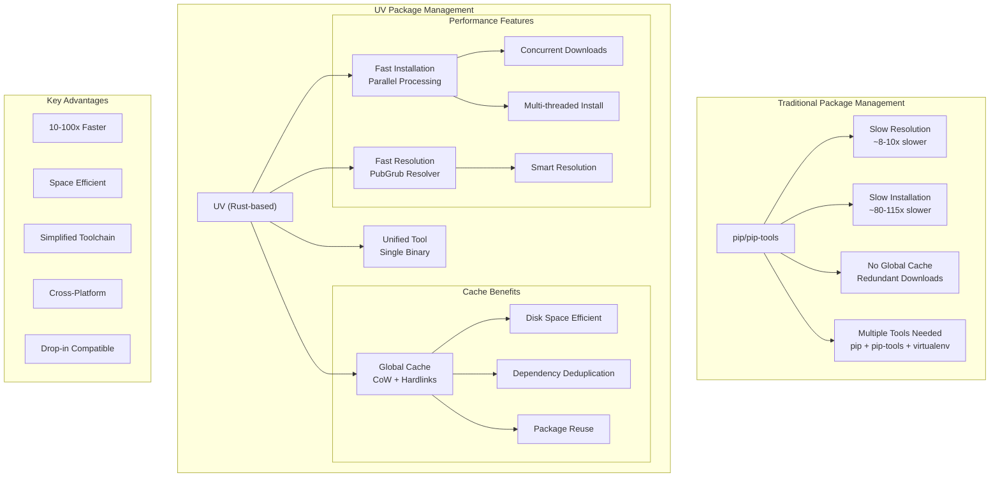
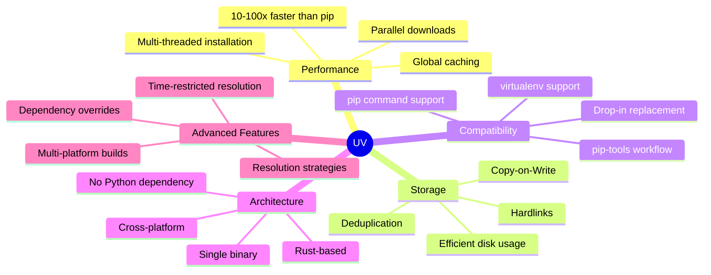
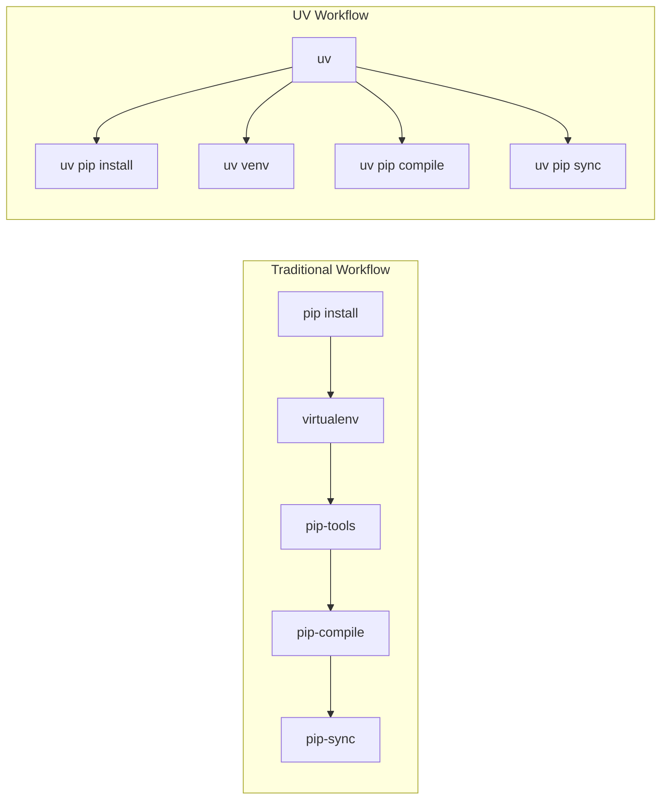

# UV vs Traditional Python Package Management

## Performance Comparison

```mermaid
gantt
    title Package Installation Time Comparison
    dateFormat X
    axisFormat %s
    
    section UV (Warm Cache)
    Installation: 0, 1
    
    section UV (Cold Cache) 
    Installation: 0, 8
    
    section pip-tools
    Installation: 0, 80
    
    section pip
    Installation: 0, 115
```

## Key Features

## Workflow Comparison

## Benefits Summary

1. **Performance**
   - 80-115x faster with warm cache
   - 8-10x faster with cold cache
   - Parallel downloads and installations
   - Efficient caching system

2. **Storage Efficiency**
   - Global package cache
   - Copy-on-Write optimization
   - Hardlink utilization
   - Dependency deduplication

3. **Simplified Toolchain**
   - Single binary installation
   - No Python dependency
   - Replaces multiple tools (pip, pip-tools, virtualenv)
   - Cross-platform support

4. **Advanced Features**
   - Alternative resolution strategies
   - Dependency version overrides
   - Multi-platform resolution
   - Time-restricted reproducible resolutions

5. **Developer Experience**
   - Drop-in compatibility
   - Familiar commands
   - Better error messages
   - Simplified workflow
